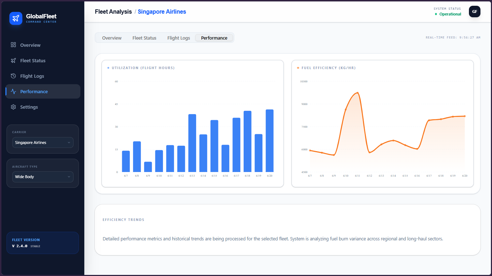
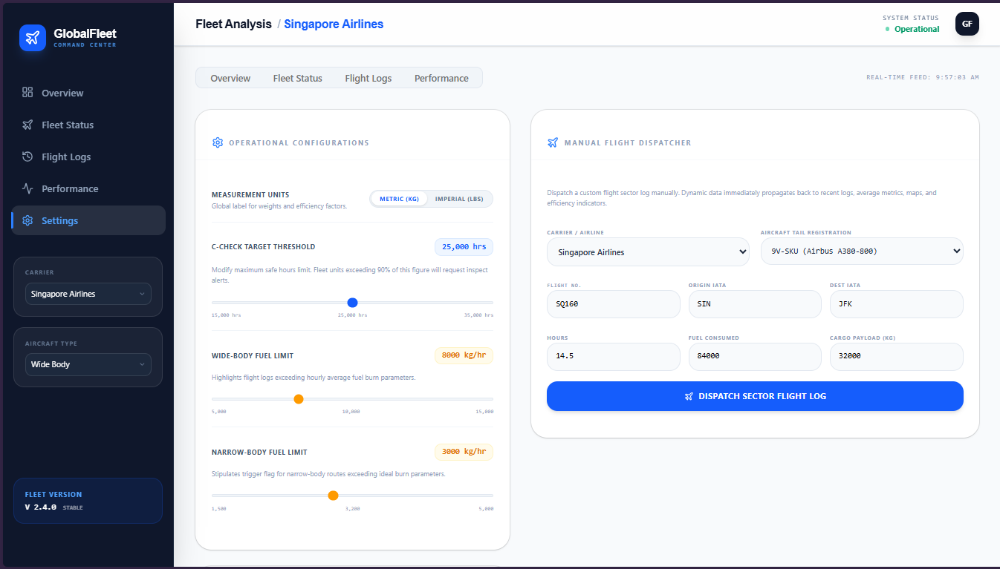

# ✈️ Fleet Intelligence & Analysis Dashboard

A pristine, high-performance, responsive full-stack platform designed for commercial aviation fleet logistics, carrier metrics monitoring, and fuel burn profiling. This system integrates real-time telemetry simulations with structural airline parameters to automate fleet health monitoring, efficiency auditing, and predictive segment checkers.

---

<!-- ========================================== -->
<!--   SCREENSHOT PLACEHOLDER 1: HERO DISPLAY   -->
<!--   Recommended: dashboard_overview.png     -->
<!-- ========================================== -->
<p align="center">
  
  <br />
  <em>▲ Figure 1: The primary Dashboard interface featuring reactive airline telemetry filters, live carrier status metrics, and responsive desktop/mobile layout states.</em>
</p>

---

## 🎨 Visual Identity & Design Aesthetics

The application utilizes a tailored, modern, and high-contrast **Swiss Minimalist Slate Theme**:
- **Typography**: Paired "Space Grotesk" for display headings (adding a tech-forward posture) with standard "Inter" for interface controls and high-contrast "JetBrains Mono" for strict raw telemetry, coordinates, and statistics.
- **Negative Space**: Generous borders, adaptive flex grids, and soft off-white card modules with deep slate charcoal borders prevent cognitive clutter on high-density data visualizations.
- **Interactive Feedback**: Responsive hover gradients, glowing telemetry markers, and micro-animations via `motion/react` provide immersive tactility on custom components.

---

## 🚀 Key Functional Modules

### 1. Robust Multi-Airline Overview Dashboard
- Filter flight schedules dynamically across major regional carriers (**Singapore Airlines**, **Lufthansa**, **Cathay Pacific**, **British Airways**) and structures (**Wide-Body** vs. **Narrow-Body**).
- Responsive design features a dedicated desktop sidebar paired with a smart mobile collapsible slide-out drawer constraint context.

### 2. Secure Fuel Efficiency & Analytics Engine
- Live dual-standard measurement conversions supporting both **Metric (Kilograms)** and **Imperial (Pounds)** systems. Transitioning toggles update all active components instantly in real-time.
- Interactive SVG Area charts powered by `recharts` to chart daily efficiency indices, sector averages, and variance rates.

<!-- ============================================== -->
<!--   SCREENSHOT PLACEHOLDER 2: ANALYTICAL ENGINE  -->
<!--   Recommended: fuel_efficiency_charts.png     -->
<!-- ============================================== -->
<p align="center">
  
  <br />
  <em>▲ Figure 2: Responsive performance charts reporting real-time utilization profiles, hourly averages, and localized fuel efficiency boundaries.</em>
</p>

### 3. Live Manual Flight Dispatcher & Telemetry Injector
- Located on the settings tab, users can queue manual flight routes. Input fields dynamically generate standard airline-prefixed flight IDs, tail numbers, and expected fuel burns relative to the chosen registration.
- **Data Spillway Modulators**: Inject bad/anomalous data logs directly to simulate localized, over-temperature, or high-utilization sectors and evaluate how safety alerts behave.

### 4. Predictive Check & Threshold Alerts
- Real-time maintenance progression track bars evaluating aggregate flight cycles limits.
- Live alerts trigger warning badges (`inspection` or `overdue`) when airframes near 90% or 100% of the C-Check hours limit set in the settings controller.

### 5. Fleet Performance & Route Optimizer
- Server-side intelligence engine to compute statistical optimization recommendations and efficiency reports.
- Designed using a resilient **Expert Domain Fallback Strategy** to gracefully serve offline analytical observations and simulated telemetry reports instantly.

<!-- ================================================ -->
<!--   SCREENSHOT PLACEHOLDER 3: SETTINGS CONTROL HUB   -->
<!--   Recommended: manual_dispatcher_suite.png       -->
<!-- ================================================ -->
<p align="center">
  
  <br />
  <em>▲ Figure 3: Interactive Settings dashboard featuring sliding threshold controllers, Metric/Imperial switch toggles, and the manual flight dispatcher suite.</em>
</p>

---

## 🛠️ Built-With Technology Stack

- **Frontend Core**: React 18+ (Framer Motion, Tailwind CSS, Lucide Icons)
- **Data Engineering**: Recharts (Dynamic SVG Visualizations), D3 scale utilities
- **Secure Backend Router**: Express.js (Node.js runtime)
- **Analytics Engine**: Pre-calculated and live telemetry statistical analyzer (with adaptive server fallback)

---

## ⚙️ How to Make the Web App Live on GitHub

Because this is a full-stack **Express server with a React (Vite)** single-port reverse proxy layout, hosting it on standard GitHub Pages (which only processes static HTML/CSS files) will sever the backend API routes. 

### Option 1: Full-Stack Live Deployment (Recommended)
You can deploy the complete experience (Server + UI) for **free** on developer platforms that support continuous deployment directly from your GitHub repository:

*   **Render (render.com)**:
    1. Sign up on Render and connect your GitHub account.
    2. Click **New** -> **Web Service**.
    3. Select your repository.
    4. Configure the environment variables and scripts:
       - **Runtime**: `Node`
       - **Build Command**: `npm install && npm run build`
       - **Start Command**: `npm start`
    5. Save and deploy to launch your application service globally.

*   **Railway (railway.app)**:
    1. Sign up and connect your GitHub.
    2. Click **New Project** -> **Deploy from GitHub repo**.
    3. Railway automatically detects the `package.json` setup and starts the web container.

---

### Option 2: Static Client-Only Deployment (GitHub Pages)
If you specifically want to use **GitHub Pages**, you can host the interactive UI client-side only by compiling the static files (using our designed client-side fallback features):

1.  **Configure Vite Output**:
    Confirm your `/vite.config.ts` matches your repository relative URL path if deploying under a subdirectory:
    ```ts
    // If your URL is https://<username>.github.io/<repo-name>/
    export default defineConfig({
      base: '/<repo-name>/',
      // ...other config
    })
    ```
2.  **Install the build tool wrapper**:
    ```bash
    npm install gh-pages --save-dev
    ```
3.  **Add Deployment Scripts** inside your `package.json` `"scripts"` section:
    ```json
    "predeploy": "npm run build",
    "deploy": "gh-pages -d dist"
    ```
4.  **Publish Immediately**:
    ```bash
    npm run deploy
    ```
    *Note: In the static deployment, the platform will use our built-in offline expert domain generators for flight analytics and insights gracefully when the client makes simulated endpoints.*

---

## 📦 Local Workspace Executions

To boot the app locally on your laptop:

### 1. Initialize dependencies
```bash
npm install
```

### 2. Run the full environment (Development Port: 3000)
```bash
npm run dev
```

### 3. Build & Bundled Compilation (For Production)
```bash
npm run build
npm start
```
